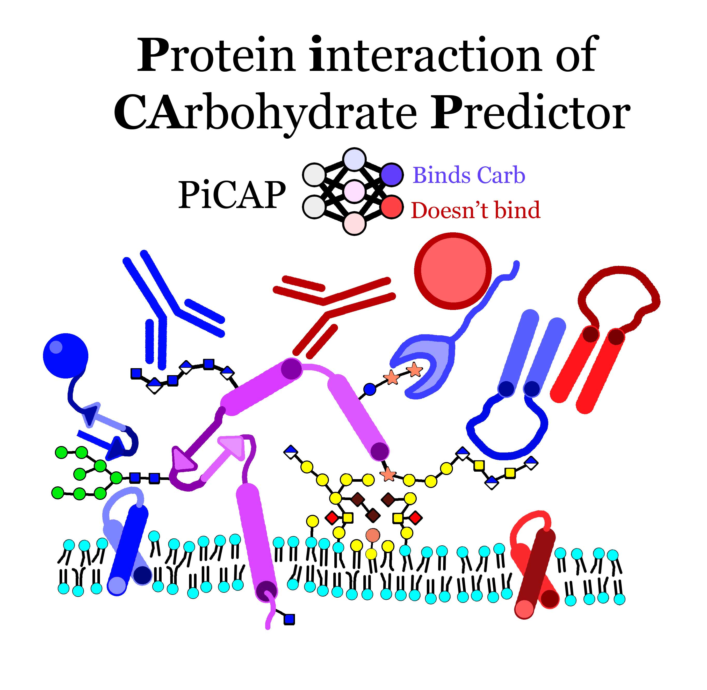

# CAPSIF2 and PiCAP #



## Quick Setup Guide ##
```
mkdir pre_pdb
mkdir output_data
mkdir models_DL
conda env create -f picap.yml
conda activate picap
```

The weights of each model are stored on our remote server [`data.graylab.jhu.edu/picap/`](https://data.graylab.jhu.edu/picap/)

Download `model-picap.pt` and `model-capsif2.pt` to `capsif2_clean/models_DL/`


# How to run #
Put all PDB files into the `input_pdb/` directory
```
python run_both.py
```
#### If using only PiCAP: ####
```
python run_both.py --picap_only
```
#### If using only CAPSIF2: ####
```
python run_both.py --capsif2_only
```

#### If using computational structures with a pLDDT cutoff ####
```
python run_both.py --high_plddt --plddt_cutoff 70
```
`plddt_cutoff` can be changed to any value, the publication uses 70 as the cutoff for AF2 structures.

the predictions will then be outputted to `output_data/predictions_prot.tsv` and `output_data/predictions_res.tsv` for PiCAP and CAPSIF2, respectively.

If running both, then the data will be outputted to `output_data/all_predictions.tsv`

All predictions for CAPSIF2 are also outputted individually as PDB files in the `output_data/` directory.


## Supplemental data ##

We include the NoCAP and DR datasets in the `datasets/` directory with a list of PDBs. All non-RCSB retrievable structures (e.g. designed non-binders and ProGen lysozymes) are at the remote server [`data.graylab.jhu.edu/picap/`](https://data.graylab.jhu.edu/picap/).

